# 一、索引的概述

## 1.为什么要使用索引

在海量数据中进行查询某条记录的场景是经常发生的，那么如何提升查询性能，就跟要查询的数据字段是否有索引有关系。如果字段加了索引，那么查询的性能就非常快！——就是为了快！

- 索引为什么快？
- 索引到底是什么？
- 在使用索引的是要注意什么样的事项？


## 2.索引是什么

查字典的方式？“数”shu--通过目录来查，能够快速的定位到目标数据所在的页码。

没有使用索引的时候，数据的查询需要进行多次IO读写，这样的性能较差——全表扫描的过程。

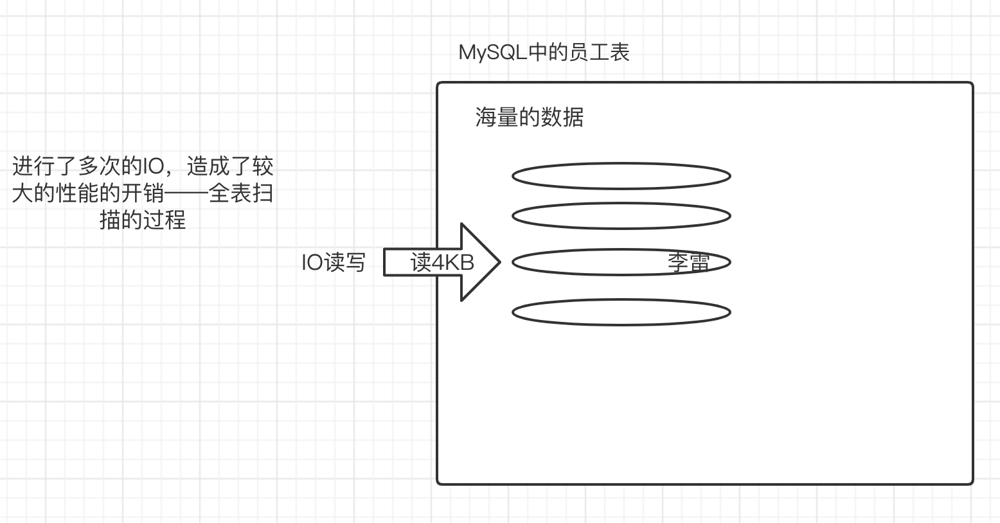


为数据库的某个字段创建索引，相当是为这个字段的内容创建了一个目录。通过这个目录可以快速的实现数据的定位，也就是通过索引能够快速的找到某条数据所在磁盘的位置。

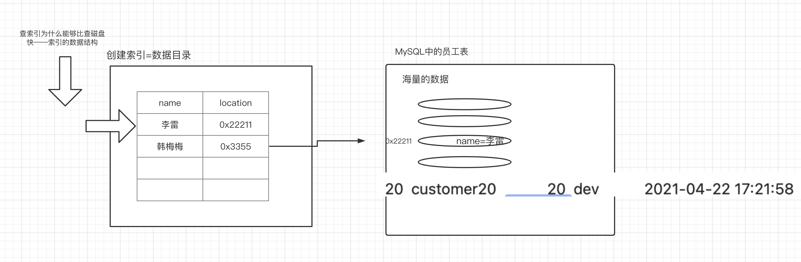

现在的疑问？

- 索引存放位置
- 索引的分类及如何创建
- 索引使用了哪种数据结构：各种数据结构的查询性能进行分析


## 3.索引存放的位置

对于mac系统在/usr/local/mysql文件夹中，对于win系统c:/programdata/mysql(隐藏文件夹)

- InnoDB存储引擎的表：将索引和数据存放在同一个文件里。（为什么？有什么优势？）*.ibd
- MyISAM存储引擎的表：索引和数据分开两个文件来存储。索引：*.MYI ;      数据：MYD


## 4.索引的分类

- 主键索引：主键自带索引效果，也就意味着通过主键来查询表中的记录，性能是非常好的。
- 普通索引：为普通列创建的索引。

创建索引的命令：

```sql
# 格式
create index 索引名称 on 表名(列名)
# 例子
create index idx_name on employees(name)
```

- 唯一索引：就像是唯一列，列中的数据是唯一的。比普通索引的性能要好。

```sql
# 格式
create unique index 索引名称 on 表名(列名)
# 例子
create unique index idx_unique_name on employees(name)
```

- 联合索引（组合索引）：一次性为表中的多个字段一起创建索引，最左前缀法则（如何命中联合索引中的索引列）。注意：一个联合索引建议不要超过5个列

```sql
# 格式
create index 索引名称 on 表(列1,列2,列3)
# 例子
create index idx_name_age_position on employees(name,age,position)
```

- 全文索引

进行查询的时候，数据源可能来自于不同的字段或者不同的表。比如去百度中查询数据，千锋教育，来自于网页的标题或者网页的内容    。MyISAM存储引擎支持全文索引。在实际生产环境中，并不会使用MySQL提供的MyISAM存储引擎的全文索引功能来是实现全文查找。而是会使用第三方的搜索引擎中间件比如ElasticSearch（多）、Solr。


# 二、索引使用的数据结构

使用索引查找数据性能很快，避免了全表扫描的多次磁盘IO读写。但是我们发现，使用索引实际上也需要在索引中查找数据，而且数据量是一样的，那么凭什么索引就能快呢？这就跟索引使用了哪种数据结构支持快速查找。

什么叫数据结构：存放数据的结构。比如：数组、链表、栈、堆、队列等等这些概念。

## 1.线性表：

线性的维护数据的顺序。

对于线性表来说，有两种数据结构来支撑：

- 线性顺序表：相邻两个数据的逻辑关系和物理位置是相同的。

- 线性链式表：相邻两个数据的逻辑关系和物理存放位置没有关系。数据是有先后的逻辑关系，但是数据的物理存储位置并不连续。

  - 单向链表：能够通过当前结点找到下一个节点的位置，以此来维护链表的逻辑关系

    结点结构： 数据内容+下一个数据的指针

  - 双向链表：能够通过当前结点找到上一个或下一个节点的位置，双向都可找。

    结点结构：  上一个数据的指针+数据内容+下一个数据的指针

顺序表和链式表的区别：

	- 数组：进行数据的查询性能（可以通过数组的索引/下标） ：时间复杂度（比较次数）/空间复杂度（算法需要使用多少个变量空间）

​              数组的查询性能非常好： 时间复杂度是O(1)。

​              数组的增删性能是非常差的：

    - 链表：查询的性能是非常差的： 时间复杂度是O(n)。

​                  增删性能是非常好的：


## 2.栈、队列、串、广义表

- 栈：先进后出，有顺序栈、链式栈
- 队列：先进先出，有顺序队列、链式队列
- 串：String 定长串、StringBuffer/Stringbuilder动态串
- 广义表：更加灵活的多维数组，可以在不同的元素中创建不同的维度的数组。


## 3.树

查找树的查找性能是明显比线性表的性能要好，那么接下来我们就要学习这么几种树：

### 1）多叉树

非二叉树

### 2）二叉树

 一个结点最多只能有2个子结点，可以是0、1、2子结点。

### 3）二叉查找树

二叉查找树的查找性能是ok的，查询性能跟树的高度有关，树的高度又根你插入数据的顺序有关系。特点：二叉树的根结点的数值是比所有左子树的结点的数值大，比右子树的几点的数值小。这样的规律同样满足于他的所有子树。

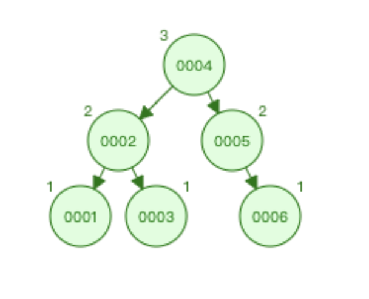

### 4）平衡二叉树（理想概念的树）

我们知道二叉查找树不能非常智能的维护树的高度，因此二叉查找树在某些情况下查询性能是不ok的，此时平衡二叉树就出现了。

- 特点： 平衡二叉树中的树及其所有子树都应满足：左子树和右子树的深度差不能超过1

如果平衡二叉树不满足这个特点，那么平衡二叉树要进行自己旋转，如何自己旋转：

   左旋、右旋、双向（先左后右、先右后左）

### 5）红黑树（平衡二叉树的一种体现）

平衡二叉树为了维护树的平衡，在一旦不满足平衡的情况就要进行自旋，但是自旋会造成一定的系统开销。因此红黑树在自旋造成的系统开销和减少查询次数之间做了权衡。因此红黑树有时候并不是一颗平衡二叉树。

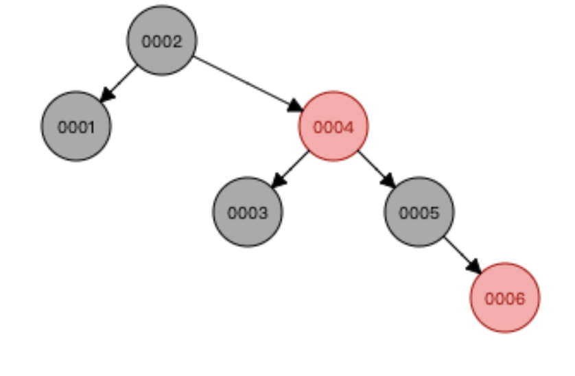

红黑树已经是在查询性能上得到了优化，但索引依然没有使用红黑树作为数据结构来存储数据，因为红黑树在每一层上存放的数据内容是有限的，导致数据量一大，树的深度就变得非常大，于是查询性能非常差。因此索引没有使用红黑树。

### 6）B树

B树允许一个结点存放多个数据。这样可以使更小的树的深度来存放更多的数据。但是，B树的一个结点中到底能存放多少个数据，决定了树的深度。

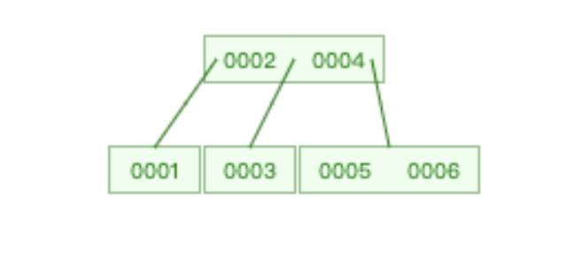

通过数值计算，B树的一个结点最多只能存放15个数据，因此B树依然不能满足海量数据的查询性能优化。


### 7）B+树

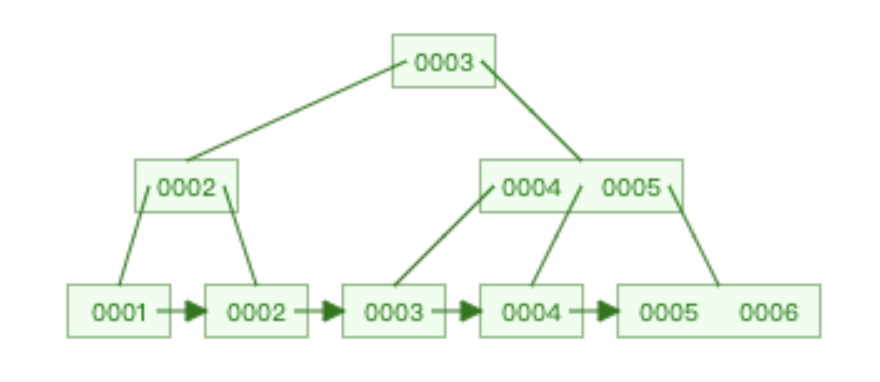

- B+树的特点：
  - 非叶子结点冗余了叶子结点中的键。
  - 叶子结点是从小到大、从左到右排列的
  - 叶子结点之间提供了指针，提高了区间访问的性能
  - 只有叶子结点存放数据，非叶子结点是不存放数据的，只存放键


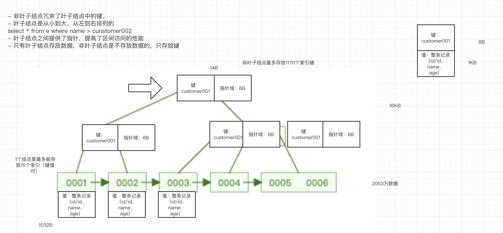


### 8）哈希表

使用哈希表来存取数据的性能是最快的，O(1)，但是不支持范围查找（区间访问）


# 三、InnoDB和MyISAM的区别

InnoDB和MyISAM都是数据库表的存储引擎。那么在互联网公司，或者追求查询性能的场景下，都会使用InnoDB作为表的存储引擎。

为什么？

## 1.InnoDB引擎——聚集索引

把索引和数据存放在一个文件中，通过找到索引后就能直接在索引树上的叶子结点中获得完整的数据。

可以实现行锁/表锁


## 2.MyISAM存储引擎——非聚集索引

把索引和数据存放在两个文件中，查找到索引后还要去另一个文件中找数据，性能会慢一些。

除此之外，MyISAM天然支持表锁，而且支持全文索引。


# 四、索引常见的面试题

## 1.问题一：为什么非主键索引的叶子节点存放的数据是主键值

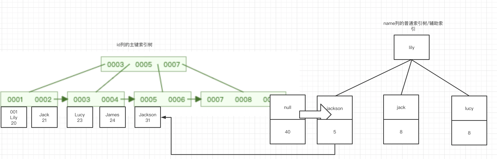

如果普通索引中不存放主键，而存放完整数据，那么就会造成：

- 数据冗余，虽然提升了查询性能，但是需要更多的空间来存放冗余的数据
- 维护麻烦：一个地方修改数据，需要在多棵索引树上修改。


## 2.问题二：为什么InnoDB表必须创建主键

创建InnoDB表不使用主键能创建成功吗？如果能创建功能，能不能为这张表的普通列创建索引？

如果没有主键，MySQL优化器会给一个虚拟的主键，于是普通索引会使用这个虚拟主键——也会造成性能开销。为了性能考虑，和设计初衷，那么创建表的时候就应该创建主键。


## 3.问题三：为什么使用主键时推荐使用整型的自增主键

### 1）为什么要使用整型：

主键-主键索引树-树里的叶子结点和非叶子结点的键存放的是主键的值，而且这颗树是一个二叉查找树。数据的存放是有大小顺序的。

- 整型： 大小顺序是很好比较的
- 字符串：字符串的自然顺序的比较是要进行一次编码成为数值后再进行比较的。（字符串的自然顺序，A Z）

   uuid随机字符串

### 2）为什么要自增：

如果不用自增：  （10    1  6。 200。 18。29）使用不规律的整数来作为主键，那么主键索引树会使用更多的自旋次数来保证树索引树的叶子节点中的数据是从小到大-从左到右排列，因此性能必然比使用了自增主键的性能要差！


# 五、联合索引和最左前缀法则

## 1.联合索引的特点

在使用一个索引来实现多个表中字段的索引效果。


## 2.联合索引是如何存储的

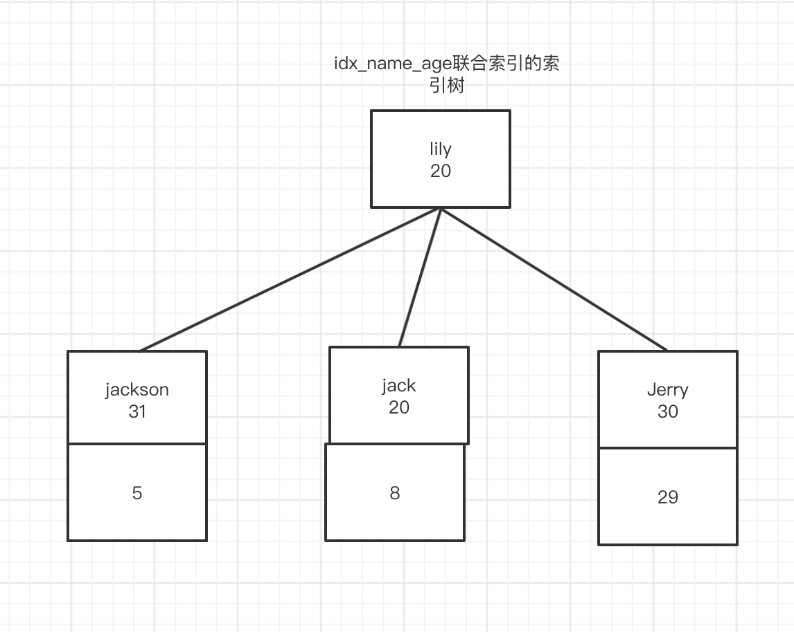

## 3.最左前缀法则

最左前缀法则是表示一条sql语句在联合索引中有没有走索引（命中索引/不会全表扫描）

```sql
# 创建联合索引
create index idx_a_b_c on table1(a,b,c);
# sql语句有没有命中索引
select * from table1 where a = 10;
select * from table1 where a = 10 and b=20;
select * from table1 where a = 10 and b=20 and c=30;
select * from table1 where b = 10;
select * from table1 where b = 10 and c=30;
select * from table1 where a = 10 and c=30;
select * from table1 where c = 30;
select * from table1 where a = 10 and c = 30 and b = 20; (abc全走)=》mysql有一个内部优化器 会做一次内部优化。

```


# 六、SQL优化

SQL优化的目的是为了SQL语句能够具备优秀的查询性能，实现这样的目的有很多的途径：

- 工程优化如何实现：数据库标准、表的结构标准、字段的标准、创建索引
- SQL语句的优化：当前SQL语句有没有命中索引。

## 1.工程优化如何实现

参考《MySQL军规升级版》


## 2.Explain执行计划——SQL优化神器

得知道当前系统里有哪些SQL是慢SQL，查询性能超过1s的sql，然后再通过Explain工具可以对当前SQL语句的性能进行判断——为什么慢，怎么解决。

要想知道哪些SQL是慢SQL，有两种方式，一种是开启本地MySQL的慢查询日志；另一种是阿里云提供的RDS（第三方部署的MySQL服务器），提供了查询慢SQL的功能。

```sql
explain SELECT * from employees where name like "customer100%"
```

通过在SQL语句前面加上explain关键字，执行后并不会真正的执行sql语句本身，而是通过explain工具来分析当前这条SQL语句的性能细节：比如是什么样的查询类型、可能用到的索引及实际用到的索引，和一些额外的信息。

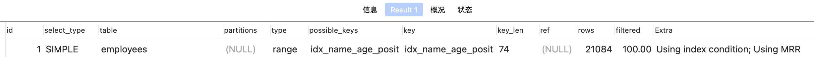


## 3.MySQL的内部优化器

在SQL查询开始之前，MySQL内部优化器会进行一次自我优化，让这一次的查询性能尽可能的好。

当前执行的SQL

```sql
explain select * from tb_book where id=1;
show warnings;
```

内部优化器优化后的效果：

```sql
/* select#1 */ select '1' AS `id`,'千锋Java厉害' AS `name` from `db_mysql_pro`.`tb_book` where true
```


## 4.select_type列

关闭 MySQL 对衍生表的合并优化：

```sql
set session optimizer_switch='derived_merge=off'; 
```


执行了这样的计划：

```sql
EXPLAIN select (select 1 from tb_author where id=1) from (select * from tb_book where id=1) der;
```

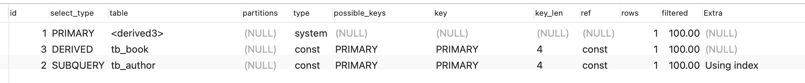

- derived：

第一条执行的sql是from后面的子查询，该子查询只要在from后面，就会生成一张衍生表，因此他的查询类型：derived

- subquery：

在select之后 from之前的子查询

- primary：

最外部的select

- simple：

不包含子查询的简单的查询

- union：

使用union进行的联合查询的类型


## 5.table列

当前查询正在查哪张表


## 6.type列

type列可以直观的判断出当前的sql语句的性能。type里的取值和性能的优劣顺序如下：

```sql
null > system > const > eq_ref > ref > range > index > all
```

对于SQL优化来说，要尽量保证type列的值是属于range及以上级别。

- null

性能最好的，一般在使用了聚合函数操作索引列，结果直接从索引树获取即可，因此是性能最好。

- system

很少见。直接和一条记录进行匹配。

- const

使用主键索引或唯一索引和常量进行比较，这种性能非常好

- eq_ref

在进行多表连接查询时。如果查询条件是使用了主键进行比较，那么当前查询类型是eq_ref

```sql
EXPLAIN select * from tb_book_author left JOIN tb_book on tb_book_author.book_id = tb_book.id
```

- ref

  - 简单查询：EXPLAIN select * from tb_book where name='book1'

  ​      如果查询条件是普通列索引，那么类型ref

  - 复杂查询：EXPLAIN select book_id from tb_book left join tb_book_author on tb_book.id = tb_book_author.book_id

  ​     如果查询条件是普通列索引，那么类型ref

- range:

 使用索引进行范围查找

```sql
explain select * from tb_book where id>1
```

- index

查询没有进行条件判断。但是所有的数据都可以直接从索引树上获取(book表中的所有列都有索引)

```sql
explain select * from tb_book
```

- all

没有走索引，进行了全表扫描

```sql
explain select * from tb_author
```


## 7.id列

在多个select中，id越大越先执行，如果id相同。上面的先执行。


## 8.possible keys列

这一次的查询可能会用到的索引。也就是说mysql内部优化器会进行判断，如果这一次查询走索引的性能比全表扫描的性能要查，那么内部优化器就让此次查询进行全表扫描——这样的判断依据我们可以通过trace工具来查看

```sql
EXPLAIN select * from employees where name like 'custome%'
```

这条sql走索引查询的行数是500多万，那么总的数据行数也就500多万，因此直接进行全表扫描性能更快


## 9.key列

实际该sql语句使用的索引


## 10.rows列

该sql语句可能要查询的数据条数


## 11.key_len列

键的长度，通过这一列可以让我们知道当前命中了联合索引中的哪几列。

```sql
EXPLAIN select * from employees where name = 'customer10011' # 74
EXPLAIN select * from employees where name = 'customer10011' and age=30 # 74 4 = 78
EXPLAIN select * from employees where name = 'customer10011' and age=30 and position='dev' # 74 4 62 = 140
EXPLAIN select * from employees where name = 'customer10011' and position='dev' # 74
```

name长度是74，也就是当看到key-len是74，表示使用了联合索引中的name列

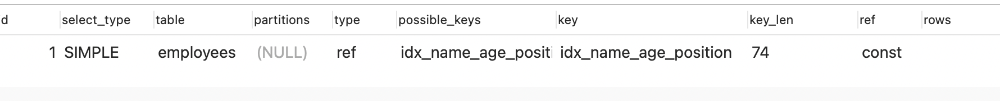

计算规则：

```
- 字符串
1. char(n): n字节长度
2. varchar(n): 2字节存储字符串长度,如果是utf-8,则长度3n + 2

- 数值类型
1. tinyint: 1字节
2. smallint: 2字节
3. int: 4字节
4. bigint: 8字节

- 时间类型
1. date: 3字节
2. timestamp: 4字节
3. datetime: 8字节

如果字段允许为NULL,需要1字节记录是否为NULL
索引最大长度是768字节,当字符串过长时, mysql会做一个类似左前缀索引的处理,将前半部分的字符提取出来做索引
```


## 12.extra列

extra列提供了额外的信息，是能够帮助我们判断当前sql的是否使用了覆盖索引、文件排序、使用了索引进行查询条件等等的信息。

- Using index:使用了覆盖索引

  所谓的覆盖索引，指的是当前查询的所有数据字段都是索引列，这就意味着可以直接从索引列中获取数据，而不需要进行查表。

  使用覆盖索引进行性能优化这种手段是之后sql优化经常要用到的。

```sql
EXPLAIN select book_id,author_id from tb_book_author where book_id = 1 -- 覆盖索引
EXPLAIN select * from tb_book_author where book_id = 1 -- 没有使用覆盖索引
```

- using where

  使用了普通索引列做查询条件

```sql
EXPLAIN select * from tb_author where name > 'a'
```

- using index condition

查询结果没有使用覆盖索引，建议可以使用覆盖索引来优化

```sql
EXPLAIN select * from tb_book_author where book_id > 1
```

- Using temporary

在非索引列上进行去重操作就需要使用一张临时表来实现，性能是非常差的。当前name列没有索引

```sql
EXPLAIN select DISTINCT name from tb_author
```

- Using filesort

使用文件排序： 会使用磁盘+内存的方式进行文件排序，会涉及到两个概念：单路排序、双路排序

```sql
EXPLAIN select * from tb_author order by name
```

- Select tables optimized away

直接在索引列上进行聚合函数的操作，没有进行任何的表的操作

```sql
EXPLAIN select min(id) from tb_book
```


# 七、Trace工具

在执行计划中我们发现有的sql会走索引，有的sql即使明确使用了索引也不会走索引。这是因为mysql的内部优化器任务走索引的性能比不走索引全表扫描的性能要差，因此mysql内部优化器选择了使用全表扫描。依据来自于trace工具的结论。

```sql
set session optimizer_trace="enabled=on", end_markers_in_json=on; -- 开启trace
 select * from employees where name > 'a' order by position; -- 执行查询
 SELECT * FROM information_schema.OPTIMIZER_TRACE; -- 获得trace的分析结果
```


```json
{
  "steps": [
    {
      "join_preparation": { -- 阶段1:进入到准备阶段
        "select#": 1,
        "steps": [
          {
            "expanded_query": "/* select#1 */ select `employees`.`id` AS `id`,`employees`.`name` AS `name`,`employees`.`age` AS `age`,`employees`.`position` AS `position`,`employees`.`hire_time` AS `hire_time` from `employees` where (`employees`.`name` > 'a') order by `employees`.`position`"
          }
        ] /* steps */
      } /* join_preparation */
    },
    {
      "join_optimization": { -- 阶段2: 进入到优化阶段
        "select#": 1,
        "steps": [
          {
            "condition_processing": { -- 条件处理
              "condition": "WHERE",
              "original_condition": "(`employees`.`name` > 'a')",
              "steps": [
                {
                  "transformation": "equality_propagation",
                  "resulting_condition": "(`employees`.`name` > 'a')"
                },
                {
                  "transformation": "constant_propagation",
                  "resulting_condition": "(`employees`.`name` > 'a')"
                },
                {
                  "transformation": "trivial_condition_removal",
                  "resulting_condition": "(`employees`.`name` > 'a')"
                }
              ] /* steps */
            } /* condition_processing */
          },
          {
            "substitute_generated_columns": {
            } /* substitute_generated_columns */
          },
          {
            "table_dependencies": [ -- 表依赖详情
              {
                "table": "`employees`",
                "row_may_be_null": false,
                "map_bit": 0,
                "depends_on_map_bits": [
                ] /* depends_on_map_bits */
              }
            ] /* table_dependencies */
          },
          {
            "ref_optimizer_key_uses": [
            ] /* ref_optimizer_key_uses */
          },
          {
            "rows_estimation": [
              {
                "table": "`employees`",
                "range_analysis": {
                  "table_scan": {
                    "rows": 5598397,
                    "cost": 576657
                  } /* table_scan */,
                  "potential_range_indexes": [ -- 可能使用到的索引
                    {
                      "index": "PRIMARY", -- 主键索引
                      "usable": false,
                      "cause": "not_applicable"
                    },
                    {
                      "index": "idx_name_age_position", -- 联合索引
                      "usable": true,
                      "key_parts": [
                        "name",
                        "age",
                        "position",
                        "id"
                      ] /* key_parts */
                    },
                    {
                      "index": "idx_hire_time",
                      "usable": false,
                      "cause": "not_applicable"
                    }
                  ] /* potential_range_indexes */,
                  "setup_range_conditions": [
                  ] /* setup_range_conditions */,
                  "group_index_range": {
                    "chosen": false,
                    "cause": "not_group_by_or_distinct"
                  } /* group_index_range */,
                  "skip_scan_range": {
                    "potential_skip_scan_indexes": [
                      {
                        "index": "idx_name_age_position",
                        "usable": false,
                        "cause": "query_references_nonkey_column"
                      }
                    ] /* potential_skip_scan_indexes */
                  } /* skip_scan_range */,
                  "analyzing_range_alternatives": { -- 分析各个索引使用的成本
                    "range_scan_alternatives": [
                      {
                        "index": "idx_name_age_position",
                        "ranges": [
                          "a < name"
                        ] /* ranges */,
                        "index_dives_for_eq_ranges": true,
                        "rowid_ordered": false,
                        "using_mrr": true,
                        "index_only": false, -- 是否使用了覆盖索引
                        "rows": 2799198, -- 要扫描的行数
                        "cost": 2.08e6, -- 要花费的时间
                        "chosen": false, -- 是否选择使用这个索引
                        "cause": "cost" -- 不选择的原因：开销比较大
                      }
                    ] /* range_scan_alternatives */,
                    "analyzing_roworder_intersect": {
                      "usable": false,
                      "cause": "too_few_roworder_scans"
                    } /* analyzing_roworder_intersect */
                  } /* analyzing_range_alternatives */
                } /* range_analysis */
              }
            ] /* rows_estimation */
          },
          {
            "considered_execution_plans": [
              {
                "plan_prefix": [
                ] /* plan_prefix */,
                "table": "`employees`",
                "best_access_path": { -- 最优访问路径
                  "considered_access_paths": [ -- 最后选择的访问路径
                    {
                      "rows_to_scan": 5598397, -- 全表扫描的行数
                      "access_type": "scan", -- 全表扫描
                      "resulting_rows": 5.6e6, -- 结果的行数
                      "cost": 576655, -- 花费的时间
                      "chosen": true, -- 选择这种方式
                      "use_tmp_table": true
                    }
                  ] /* considered_access_paths */
                } /* best_access_path */,
                "condition_filtering_pct": 100,
                "rows_for_plan": 5.6e6,
                "cost_for_plan": 576655,
                "sort_cost": 5.6e6,
                "new_cost_for_plan": 6.18e6,
                "chosen": true
              }
            ] /* considered_execution_plans */
          },
          {
            "attaching_conditions_to_tables": {
              "original_condition": "(`employees`.`name` > 'a')",
              "attached_conditions_computation": [
              ] /* attached_conditions_computation */,
              "attached_conditions_summary": [
                {
                  "table": "`employees`",
                  "attached": "(`employees`.`name` > 'a')"
                }
              ] /* attached_conditions_summary */
            } /* attaching_conditions_to_tables */
          },
          {
            "optimizing_distinct_group_by_order_by": {
              "simplifying_order_by": {
                "original_clause": "`employees`.`position`",
                "items": [
                  {
                    "item": "`employees`.`position`"
                  }
                ] /* items */,
                "resulting_clause_is_simple": true,
                "resulting_clause": "`employees`.`position`"
              } /* simplifying_order_by */
            } /* optimizing_distinct_group_by_order_by */
          },
          {
            "reconsidering_access_paths_for_index_ordering": {
              "clause": "ORDER BY",
              "steps": [
              ] /* steps */,
              "index_order_summary": {
                "table": "`employees`",
                "index_provides_order": false,
                "order_direction": "undefined",
                "index": "unknown",
                "plan_changed": false
              } /* index_order_summary */
            } /* reconsidering_access_paths_for_index_ordering */
          },
          {
            "finalizing_table_conditions": [
              {
                "table": "`employees`",
                "original_table_condition": "(`employees`.`name` > 'a')",
                "final_table_condition   ": "(`employees`.`name` > 'a')"
              }
            ] /* finalizing_table_conditions */
          },
          {
            "refine_plan": [
              {
                "table": "`employees`"
              }
            ] /* refine_plan */
          },
          {
            "considering_tmp_tables": [
              {
                "adding_sort_to_table": "employees"
              } /* filesort */
            ] /* considering_tmp_tables */
          }
        ] /* steps */
      } /* join_optimization */
    },
    {
      "join_execution": {
        "select#": 1,
        "steps": [
          {
            "sorting_table": "employees",
            "filesort_information": [
              {
                "direction": "asc",
                "expression": "`employees`.`position`"
              }
            ] /* filesort_information */,
            "filesort_priority_queue_optimization": {
              "usable": false,
              "cause": "not applicable (no LIMIT)"
            } /* filesort_priority_queue_optimization */,
            "filesort_execution": [
            ] /* filesort_execution */,
            "filesort_summary": {
              "memory_available": 262144,
              "key_size": 40,
              "row_size": 190,
              "max_rows_per_buffer": 1379,
              "num_rows_estimate": 5598397,
              "num_rows_found": 5913852,
              "num_initial_chunks_spilled_to_disk": 1954,
              "peak_memory_used": 262144,
              "sort_algorithm": "std::stable_sort",
              "sort_mode": "<fixed_sort_key, packed_additional_fields>"
            } /* filesort_summary */
          }
        ] /* steps */
      } /* join_execution */
    }
  ] /* steps */
}
```


# 八、SQL优化实战

## 1.order by优化

在排序应用场景中，很容易出现文件排序的问题，文件排序会对性能造成影响，因此需要优化

```sql
# using filesort
Explain select * from employees where name='customer' order by position;
# 没有使用文件排序 
Explain select * from employees where name='customer' order by age, position;
# 不满足最左前缀法则，使用了文件排序
Explain select * from employees where name='customer' order by position, age;
# 满足最左前缀法则，使用索引排序
Explain select * from employees where name='customer' and age=20 order by position, age;
show WARNINGS;
/* select#1 */ select `db_mysql_pro`.`employees`.`id` AS `id`,`db_mysql_pro`.`employees`.`name` AS `name`,`db_mysql_pro`.`employees`.`age` AS `age`,`db_mysql_pro`.`employees`.`position` AS `position`,`db_mysql_pro`.`employees`.`hire_time` AS `hire_time` from `db_mysql_pro`.`employees` where ((`db_mysql_pro`.`employees`.`age` = 20) and (`db_mysql_pro`.`employees`.`name` = 'customer')) order by `db_mysql_pro`.`employees`.`position`
# 排序方向不同，没有使用索引排序
Explain select * from employees where name='customer' and age=20 order by age, position desc;
# 使用范围查询，使用了文件排序
Explain select * from employees where name in ('customer','aa') order by age, position;
# 使用范围查询，使用了文件排序
Explain select * from employees where name > 'a' order by name;
```

优化手段：

- 如果排序的字段创建了联合索引，那么尽量在业务不冲突的情况下，遵循最左前缀法则来写排序语句。
- 如果文件排序没办法避免，那么尽量想办法使用覆盖索引。all->index


## 2.group by优化

group by 的原理是先排序后分组，因此对于group by 的优化参考order by


## 3.文件排序的原理

在执行文件排序的时候，会把查询的数据的大小与系统变量：max_length_for_sort_data的大小进行比较（默认是1024字节）,如果比系统变量小，那么执行单路排序，反之则执行双路排序

-  单路排序

​       把所有的数据扔到sort_buffer内存缓冲区中，进行排序，然后结束

- 双路排序

  取数据的排序字段和主键字段，在内存缓冲区中排序完成后，将主键字段做一次回表查询，获取完整数据。


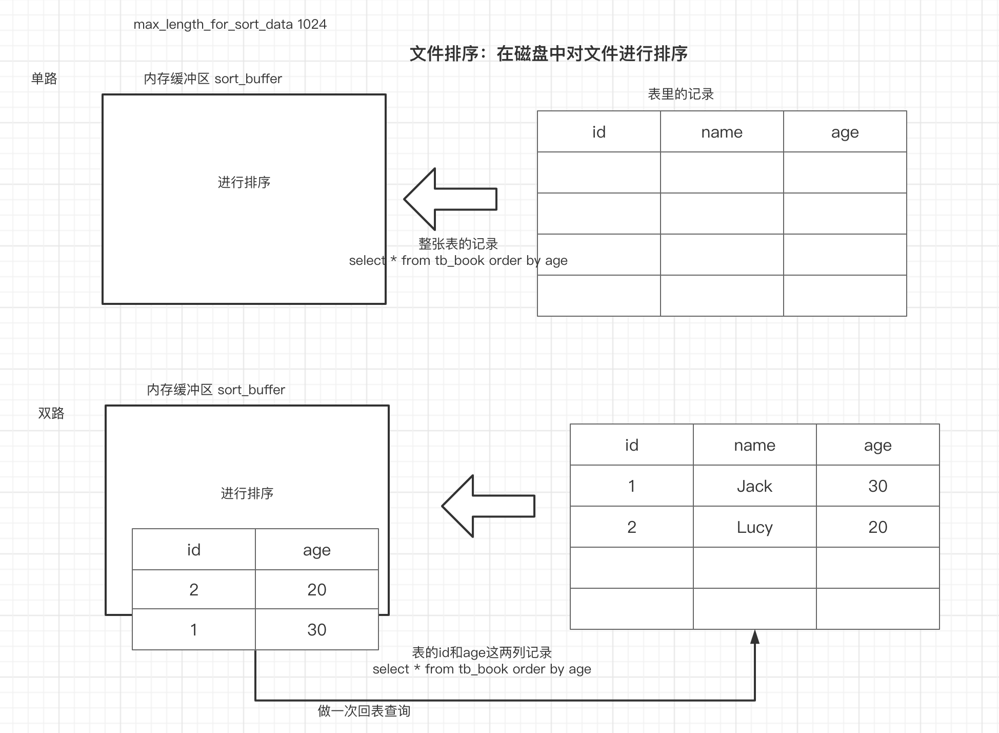


## 4.分页优化

对于这样的优化查询，mysql会把全部的10010数据拿到，并舍弃掉前面的10000条

```sql
-- 一次行获取10010，再舍弃掉前10000条
Explain select * from employees limit 1000000,10
```

 如果在主键连续的情况下，可以使用主键来做条件，但是这种情况是很少见的

```sql
Explain select * from employees where id>100000 limit 10
```

对于主键不连续情况下的例子：

```sql
Explain select * from employees order by name limit 1000000,10
-- 通过先进行覆盖索引的查找，然后在使用join做连接查询获取所有数据。这样比全表扫描要快
explain select * from employees a inner join (select id from employees order by name limit 1000000,10)  b on a.id = b.id;
```


## 5.join优化

在join中会涉及到大表（数据量大）和小表（数据量小）的概念。MySQL内部优化器会根据关联字段是否创建了索引来使用不同的算法：

- Nlj(嵌套循环算法)：如果关联字段使用了索引，mysql会对小表做全表扫描，用小表的数据去和大表的数据去做索引字段的关联查询（type：ref）

- bnlj（块嵌套循环算法）：如果关联字段没有使用索引，mysql会提供一个join buffer缓冲区，先把小表放到缓冲区中，然后全表扫描大表，把大表的数据和缓冲区中的小表数据在内存中进行匹配。

结论：使用join查询时，一定要建立关联字段的索引，且两张表的关联字段在设计之初就要做到字段类型、长度是一致的，否则索引失效。


## 6.in和exists优化

在sql中如果A表是大表，B表是小表，那么使用in会更加合适。反之应该使用exists。

- in: B的数据量<A的数据量

```sql
select * from A where id in (select id from B) 
# 相当于：
for(select id from B){ //B的数据量少，所以循环次数少。

   select * from A where A.id = B.id

}
```

- exists:  B的数据量>A的数据量 (10: id 1. 2. 3. 4)

```sql
select * from A where exists (select 1 from B where B.id = A.id)  true / false
等价于
for(select * from A){
   select * from B where B.id = A.id
}
```


## 7.count优化

对于count的优化应该是架构层面的优化，因为count的统计是在一个产品会经常出现，而且每个用户访问，所以对于访问频率过高的数据建议维护在缓存中。

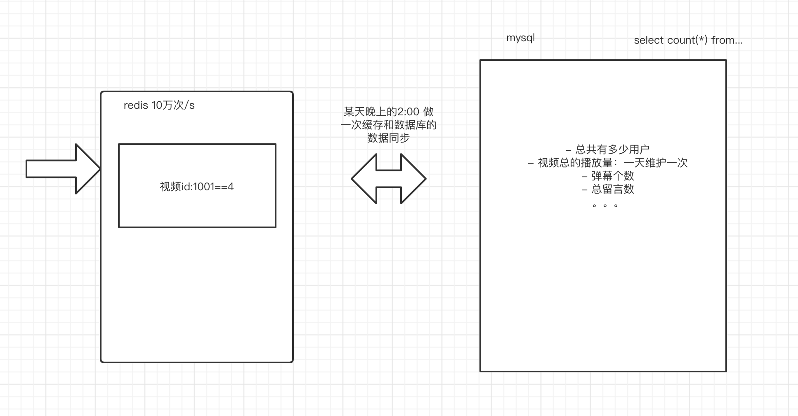


# 九、锁的定义和分类


## 1.锁的定义

锁是用来解决多个任务（线程、进程）在并发访问同一共享资源时带来的数据安全问题。虽然使用锁解决了数据安全问题，但是会带来性能的影响，频繁使用锁的程序的性能是必然很差的。

对于数据管理软件MySQL来说，必然会到任务的并发访问。那么MySQL是怎么样在数据安全和性能上做权衡的呢？——MVCC设计思想。


## 2.锁的分类

### 1）从性能上划分：乐观锁和悲观锁

- 悲观锁：悲观的认为当前的并发是非常严重的，所以在任何时候操作都是互斥。保证了线程的安全，但牺牲了并发性。——总有刁民要害朕。
- 乐观锁：乐观的认为当前的并发并不严重，因此对于读的情况，大家都可以进行，但是对于写的情况，再进行上锁。以CAS自旋锁，在某种情况下性能是ok的，但是频繁自旋会消耗很大的资源。——天网恢恢疏而不漏

### 2）从数据的操作细粒度上划分：表锁和行锁

- 表锁：对整张表上锁
- 行锁：对表中的某一行上锁。

### 3）从数据库的操作类型上划分：读锁和写锁

这两种锁都是属于悲观锁

- 读锁（共享锁）：对于同一行数据进行”读“来说，是可以同时进行但是写不行。
- 写锁（拍他锁）：在上了写锁之后，及释放写锁之前，在整个过程中是不能进行任何的其他并发操作（其他任务的读和写是都不能进行的）。


## 3.表锁

对整张表进行上锁。MyISAM存储引擎是天然支持表锁的，也就是说在MyISAM的存储引擎的表中如果出现并发的情况，将会出现表锁的效果。MyISAM不支持事务。InnoDB支持事务

在InnoDB中上一下表锁:

```sql
# 对一张表上读锁/写锁格式：
lock table 表名 read/write;
# 例子
lock table tb_book read;
# 查看当前会话对所有表的上锁情况
show open tables;
# 释放当前会话的所有锁
unlock tables;
```

读锁： 其他任务可以进行读，但是不能进行写

写锁：其他任务不能进行读和写。


## 4.行锁

MyISAM只支持表锁，但不支持行锁，InnoDB可以支持行锁。

在并发事务里，每个事务的增删改的操作相当于是上了行锁。

上行锁的方式：

- update tb_book set name='qfjava2101' where id=8;  对id是8的这行数据上了行锁。
- select * from tb_book where id=5 for update; 对id是5的这行数据上了行锁。


# 十、MVCC设计思想

MySQL为了权衡数据安全和性能，使用了MVCC多版本并发控制的设计。

## 1.事务的特性

- 原子性：一个事务是一个最小的操作单位（原子），多条sql语句在一个事务中要么同时成功，要么同时失败。
- 一致性：事务提交之前和回滚之后的数据是一致的。
- 持久性：事务一旦提交，对数据的影响是持久的。
- 隔离性：多个事务在并发访问下，提供了一套隔离机制，不同的隔离级别会有不同的并发效果。


## 2.事务的隔离级别

- read uncommitted（读未提交）： 在一个事务中读取到另一个事务还没有提交的数据——脏读。
- Read committed（读已提交）: 已经解决了脏读问题，在一个事务中只会读取另一个事务已提交的数据，这种情况会出现不可重复读的问题。就是：在事务中重复读数据，数据的内容是不一样的。
- repeatable read（可重复读）：在一个事务中每次读取的数据都是一致的，不会出现脏读和不可重复读的问题。会出现虚读（幻读）的问题。

什么是幻读：

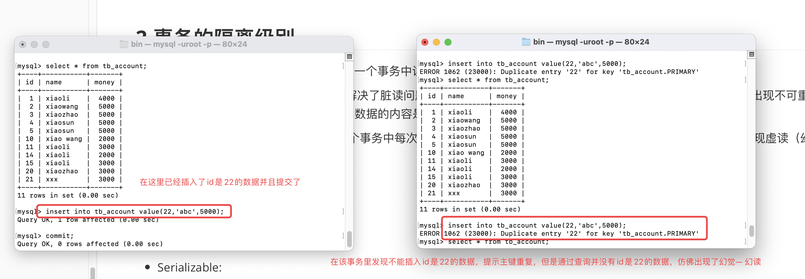

解决方案：

通过上行锁来解决虚读问题：

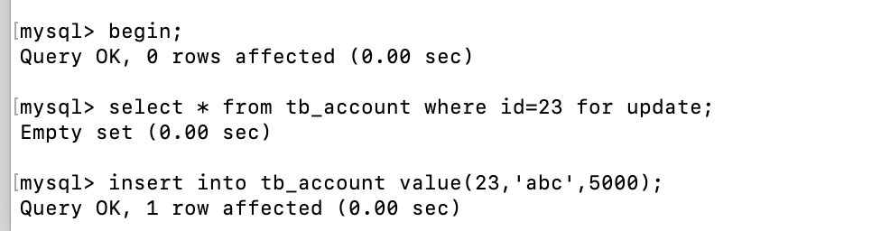

- Serializable:串行化的隔离界别直接不允许事务的并发发生，不存在任何的并发性。相当于锁表，性能非常差，一般都不考虑


脏读、不可重复读、虚读（幻读）


## 3.MVCC思想解读

MySQL在读和写的操作中，对读的性能做了并发性的保障，让所有的读都是快照读，对于写的时候，进行版本控制，如果真实数据的版本比快照版本要新，那么写之前就要进行版本（快照）更新，这样就可以既能够提高读的并发性，又能够保证写的数据安全。

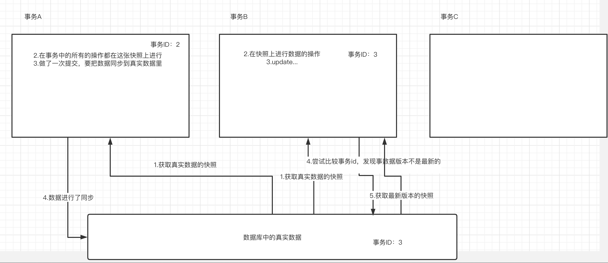


# 十一、死锁和间隙锁

## 1.死锁

所谓的死锁，就是开启的锁没有办法关闭，导致资源的访问因为无法获得锁而处于阻塞状态。

演示：事务A和事物B相互持有对方需要的锁而不释放，造成死锁的情况。

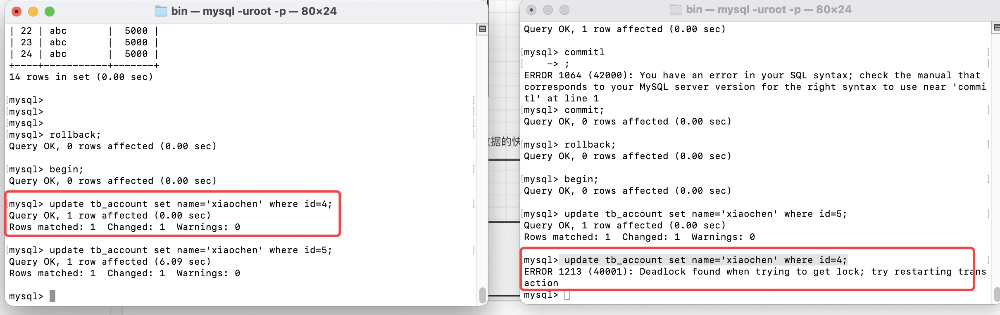

## 2.间隙锁

行锁只能对某一行上锁，如果相对某一个范围上锁，就可以使用间隙锁。间隙锁给的条件where id>13 and id<19，会对13 和19 所处的间隙进行上锁。

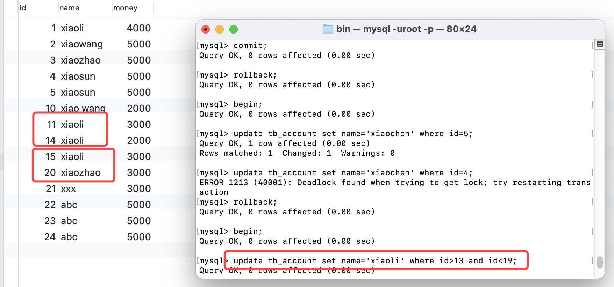